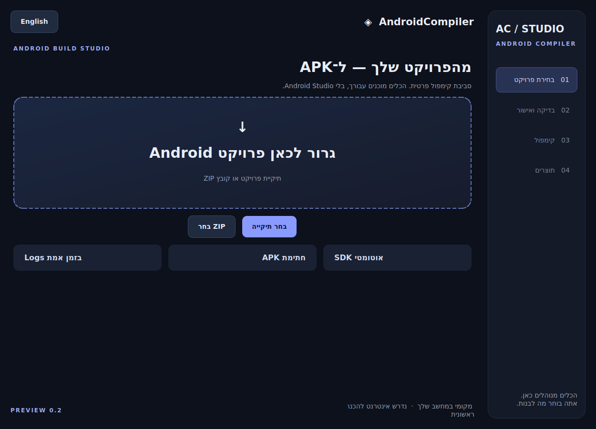

# AndroidCompiler — Preview 0.2

Windows desktop application for building APK files from supported Android Gradle projects.

**Preview:** actual Debug and signed Release builds were tested on Linux. The Preview release workflow builds on Windows, runs regression tests and checks EXE startup before publishing. The 0.2 workflow passed all 23 tests and the frozen EXE startup check on Windows. Full interactive Windows testing remains outstanding.

[Download Windows EXE / הורדת התוכנה](https://github.com/efratElchadad/exe/releases)

## שימוש

הפעילו את AndroidCompiler.exe. הקובץ פורס בעצמו את סביבת הריצה; אין צורך לחלץ ZIP ידנית. בחרו פרויקט Android, בדקו את מסך הסיכום ואשרו Build. בהפעלה הראשונה נדרשים אינטרנט ואישור רישיונות Android.

- [מדריך מלא ומגבלות](README-HE.md)
- [דוח בדיקות](TEST-REPORT.md)
- [הפוסט למתמחים טופ](FORUM-POST-HE.md)
- [רישיונות צד ג׳](THIRD-PARTY.md)

Build scripts execute with the current user's permissions. Only build projects you trust.

[Successful Windows validation](https://github.com/efratElchadad/exe/actions/runs/37206504804)
